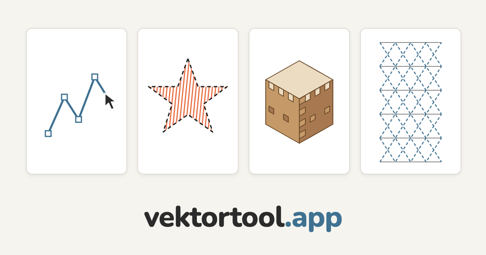

# Vektortool

**From vector to object.** A free vector graphics editor that runs entirely in
your browser - no install, no login, no server. A single HTML file.

➡ **[vektortool.app](https://vektortool.app)**

## What it does

- **Draw** - shapes, paths, freehand, text (also on a path), mirror/repeat, layers
- **Trace images** - turn a pixel image into vector paths (tracer) plus outline mode
- **Embroider** - stitch types, stitch order, export as an embroidery file (DST/PES)
- **3D printing & laser** - pattern generator (origami and more) and SVG templates
  to extrude in a slicer or cut on a laser cutter
- **Box generator** - finger-joint boxes for laser cutting

## For school and workshop

Made for school, FabLab and hobby use: **no sign-up, no cloud**, works offline.
All data stays on your device. The interface is available in German and more
than 30 other languages.

## Use it locally

The app is a single file. Open the info panel (ℹ), download the file and open
`vektortool.html` in your browser. It works fully offline, and no data leaves
your device.

## License

[PolyForm Noncommercial 1.0.0](https://polyformproject.org/licenses/noncommercial/1.0.0/)
- free for non-commercial use. © Lukas Jordi.
