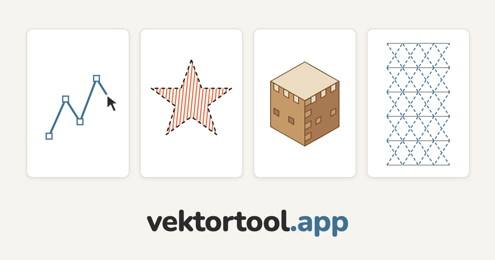

# Vektortool

**From vector to object.** Draw. Embroider. Laser-cut. 3D-print.
Free. No install, no account, works offline. A vector graphics editor that runs
entirely in your browser - a single HTML file, no server.

➡ **[vektortool.app](https://vektortool.app)**

## Release status

The 4 October 2026 release uses the tested `VT-20261004-local-r26` build
(the local identifier is retained so the released application stays byte-identical
to the tested file; SHA-256 `fedad10331bf614c0cd02cae95700543de1725d43d08e8d63fd3f9c4027f879b`).
Test cards no longer hide embroidery objects on other canvases. Exports reject
active objects whose sewn movement collapses completely on the machine grid.
Lengthwise text gains whole-word coverage checks and bounded local connections;
the finishing contour can be highlighted in the preview without changing stitches.
Round help buttons, area settings, translations and the desktop RTL embroidery
layout have also been improved. See the changelog for scope and limitations.

A fresh Gecko trace remained stitchable after creating a test card, switching
canvases and reloading in a real browser. Pacifico text and error handling were
also checked in the browser. Source-level regressions, 20 regular machine files
and 160 additional text exports were independently checked. These separately
saved encoder files are not a confirmed browser-download round trip or a sew-out.
Direct paste into the tested macOS Inkscape 1.2.1 remains unsuccessful; selected
artwork can instead be saved with Ctrl/Cmd+Shift+C for SVG file import.

Remaining work includes complex-image calculation limits, full browser download
and reopen checks, final Safari/Firefox and cold-offline checks, LightBurn, and
physical machine/material trials. Fine lettering can still contain many short
stitches and jumps; large lengthwise text can take longer to calculate. Very
small subpaths inside otherwise valid compound objects can still disappear on
the machine grid. There is no manufacturing approval. Existing projects are not
silently cleaned, and previously saved hidden objects are not automatically
unhidden. Back up important work and inspect exports in the intended target
application.
Pushing `main` automatically deploys `vektortool.html` to GitHub Pages.

## What it does

- **Draw** - shapes, paths, freehand, text (also on a path), mirror/repeat, layers
- **Fill** - flood a connected visible colour into a separate vector shape,
  with adjustable tolerance; originals stay unchanged
- **Trace images** - turn a pixel image into vector paths (tracer) plus outline mode
- **Embroider** - stitch types, stitch order, export as an embroidery file (DST/PES)
- **3D printing & laser** - pattern generator (origami and more) and SVG templates
  to extrude in a slicer or cut on a laser cutter
- **Box generator** - finger-joint boxes for laser cutting

Save editable work as **SVG (project)**. It embeds all canvases, hidden objects,
fonts and settings. For sharing visible artwork without this extra project data,
choose **SVG graphic** instead. Existing `.linea` projects can still be imported.

## For school and workshop

Made for school, FabLab and hobby use: **no sign-up, no cloud**, works offline.
All data stays on your device. The interface is available in German and more
than 30 other languages.

## Use it locally

The app is a single file. Open the info panel (ℹ), download the file and open
`vektortool.html` in your browser. It works fully offline, and no data leaves
your device.

## License

[PolyForm Noncommercial 1.0.0](https://polyformproject.org/licenses/noncommercial/1.0.0/)
- free for non-commercial use. © Lukas Jordi.
